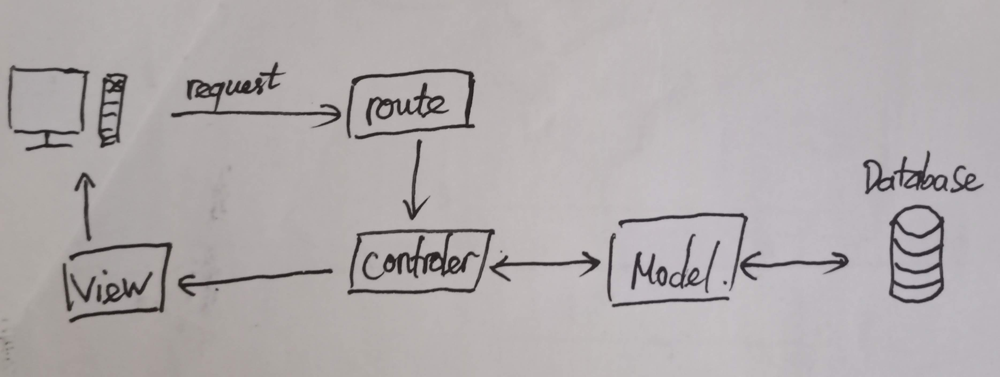
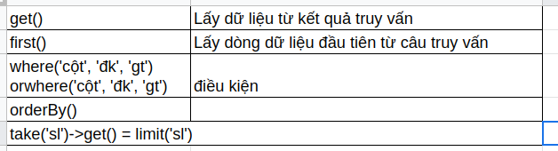

# Laravel 

## Cài đặt
`composer create-project --prefer-dist laravel/laravel TenProject "5.*"`

## Cấu trúc thư mục

### Thư mục App
- Chứa `Controller`, `Model` và các thành phần cốt lõi khác của ứng dụng.
### Thư mục Config
- Chứa các file cấu hình cho hệ thống.
### Thư mục Database
- Giúp ta tạo CSDL.
- Có ba thành phần gồm `migrate`, `seed`, `factory`.
### Thư mục Resources
- Chứa view, các file tài nguyên chưa compile(SASS, Javascript), các file ngôn ngữ.
### Thư mục Routes
- Chứa các định nghĩa `Route`.
- Gồm các file: `web.php`, `api.php`, `console.php`, `channels.php`(từ 5.8).
### Thư mục Public
- Chứa file `index.php` là điểm đầu tiên cho tất cả các request đến ứng dụng của bạn và cấu hình autoloading. Thư mục còn chứa các tài nguyên như image, css, js.
### Thư mục Tests
- Chứa các file tests.
### file .env 
- Cài đặt liên kết tới DB cho hệ thống.

## Luồng ứng dụng cơ bản



## Eloquent - Model
- Model là một lớp dữ liệu có cấu trúc giống với bảng trong CSDL, dùng để tương tác với dữ liệu trong bảng.

### Tạo Model 

```
php artisan make:model TenModel
```
### Một số thuộc tính

```php
protected $table = 'table';
protected $primaryKey = 'primaryKey';
public $timestamps = false;
...
```

### Một số phương thức

```php
App\Model::all();
App\Model::find('primaryKey');
App\Model::destroy('primaryKey');
```

- Kết hợp với query builder để tạo câu truy vấn phù hợp.


### Liên kết tới các model khác
```php
namespace App;

use Illuminate\Database\Eloquent\Model;

class User extends Model
{
    /**
     * Get the phone record associated with the user.
     */
    public function phone()
    {
        return $this->hasOne('App\Phone'); // ('Model', 'foreign_key', 'local_key')
    }
}
```

```php
$phone = User::find(1)->phone;
```

- One To One
Sử dụng ở model cha
```php
$this->hasOne()
```
Sử dụng ở model con
```php
$this->belongsTo()
```

- One To Many
```php
$this->hasMany()
```
```php
$this->belongsTo()
```

- Has One Through
```
users
    id - integer
    supplier_id - integer

suppliers
    id - integer

history
    id - integer
    user_id - integer
```

```php
class Supplier extends Model
{
    /**
     * Get the user's history.
     */
    public function userHistory()
    {
        return $this->hasOneThrough(
            'App\History',
            'App\User',
            'supplier_id', // Foreign key on users table...
            'user_id', // Foreign key on history table...
            'id', // Local key on suppliers table...
            'id' // Local key on users table...
        );
    }
}
```

- Has Many Through
```
countries
    id - integer
    name - string

users
    id - integer
    country_id - integer
    name - string

posts
    id - integer
    user_id - integer
    title - string
```

```php
<?php

namespace App;

use Illuminate\Database\Eloquent\Model;

class Country extends Model
{
    /**
     * Get all of the posts for the country.
     */
    public function posts()
    {
        return $this->hasManyThrough('App\Post', 'App\User');
    }
}
```

## Service Container

### Dependency Injection
- Dependency Injection có nghĩa là khi khởi tạo một object của class, chúng ta không cần phải khởi tạo những class liên quan (dependencies class) bên trong class đó, mà chúng sẽ được inject từ bên ngoài. Và thường gặp nhất là dạng Constructor injection , những class sẽ được inject khi khởi tạo object của class.

```php
<?php
class ReservationMailer{
    protected $mailer;
    public function __construct(Mailer $mailer){
      $this->mailer = $mailer;
    }

    public function sendReservationMail($user){
      return $this->mailer->mail($user->email, 'reservation.reserveComplete');
    }
}
?>
```

### Service Container
- Có một số vấn đề mà DI gặp phải: khi có nhiều dependencies class thì phải làm sao? Làm sao để giải quyết việc inject nối tiếp?
- Trong laravel hỗ trợ chúng ta giải quyết việc này thông qua Service Container.
- Vậy ta có thể hiểu nôm na Service Container như là tấm bản đò, một dịch vụ tổng đài để quản lý class dependency và thực hiện inject.

### Global Helper app()
```php
<?
class Alpha{
  public function __construct(){

  }
}

class Beta{
  public function __construct(){

  }
}

class Gamma{
  public function __construct(Alpha $alpha, Beta $beta){

  }
}

$gm = app(Gamma::class);
```

### Bind và Resolve
- `bind` để chỉ việc đăng ký một class hay interface với Container, và `resolve` để lấy ra instance từ Container.

```php
// Binding
\App::bind('computer', function() {
    $keyboard = new Keyboard();
    $monitor = new Monitor();
    $computer = new Computer($monitor, $keyboard);
    return $computer;
}

// Resolving.
\App::make('computer');
app('computer');
app()->make('computer');
app()['computer']
```

### Singleton binding, Instance binding, Interface binding
- **Singleton binding**: instance sẽ chỉ được resolve một lần, những lần gọi tiếp theo sẽ không tạo ra instance mới mà chỉ trả về instance đã được resolve từ trước

```php
app()->singleton('now', function() {return time();});
app('now') === app('now'); // true
```

- **Instance binding**: Cũng gần giống với Singleton Binding.
```php
$now = time();
app()->instance('now', $now);
$now === app('now'); // true
```